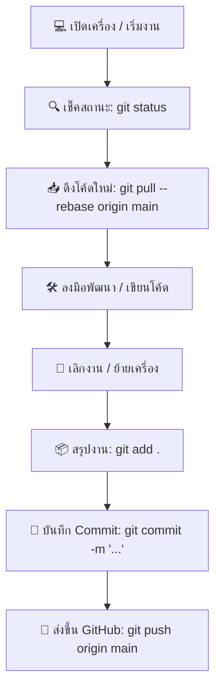

 # 📘 คู่มือการบริหารจัดการ Git สำหรับการทำงานคนเดียว 2 เครื่อง (Multi-Device Git Workflow Guide)

เอกสารนี้จัดทำขึ้นเพื่อเป็นแนวทางปฏิบัติในการสลับทำงานระหว่าง 2 เครื่อง (เช่น **คอมพิวเตอร์ที่ทำงาน** และ **คอมพิวเตอร์ที่บ้าน**) เพื่อป้องกันปัญหาโค้ดชนกัน (Merge Conflicts), โค้ดหาย หรือกิ่งโค้ดแยกสาย (Divergent Branches)

---

## 🎯 ปัญหาที่มักพบเจอเมื่อทำงานคนเดียว 2 เครื่อง

1. **ลืม Push ก่อนเลิกงาน** จากเครื่อง A ทำให้เครื่อง B ไม่มีโค้ดล่าสุด
2. **ลืม Pull ก่อนเริ่มงาน** บนเครื่อง B แล้วลงมือเขียนโค้ดต่อ ทำให้ประวัติ Git แยกเป็น 2 สาย
3. **มีไฟล์แก้ไขค้างไว้ (Uncommitted Changes)** แล้วพยายาม Pull โค้ดใหม่เข้ามา ทำให้ติด Conflict

---

## ⭐️ กฎทอง 3 ข้อ (The 3 Golden Rules)

> 1. **เริ่มงาน = `Pull` เสมอ** (ดึงโค้ดล่าสุดก่อนแตะไฟล์ใดๆ)
> 2. **เลิกงาน = `Push` เสมอ** (Commit และ Push งานขึ้น GitHub ทุกครั้งก่อนปิดเครื่อง)
> 3. **ใช้ `Rebase` แทน Plain Merge** (เพื่อให้ประวัติ Git เป็นเส้นตรง อ่านง่าย ไม่เกิด Merge Commit ขยะ)

---

## 🔄 ขั้นตอนการทำงานประจำวัน (Daily Workflow)



### 1️⃣ ตอนเริ่มงาน (Start of Day / Switch to Machine B)

ก่อนจะเริ่มแก้ไขโค้ดใดๆ ให้รันคำสั่งตามลำดับดังนี้:

```bash
# 1. เช็คว่ามีงานค้างที่ไม่ ได้บันทึกไว้ไหม
git status

# 2. ตรวจสอบข้อมูลอัปเดตจาก GitHub
git fetch origin

# 3. ดึงโค้ดล่าสุดลงมาด้วย Rebase
git pull --rebase origin main
```

---

### 2️⃣ ตอนเลิกงาน (End of Day / Leaving Machine A)

เมื่อพัฒนาเรียบร้อยแล้ว หรือเตรียมย้ายไปทำอีกเครื่องหนึ่ง:

```bash
# 1. เช็คไฟล์ที่มีการเปลี่ยนแปลง
git status

# 2. นำไฟล์ทั้งหมดเข้าเตรียม Commit
git add .

# 3. สร้าง Commit พร้อมข้อความอธิบายงานที่ทำ
git commit -m "feat: เพิ่มระบบบันทึกสถานะ PO"

# 4. Push ขึ้น GitHub
git push origin main
```

--- 

## 🛠️ การจัดการเมื่อเกิดปัญหาพบบ่อย (Troubleshooting)

### Case A: เขียนโค้ดไปแล้ว แต่นึกได้ว่าลืม Pull โค้ดใหม่มาจากอีกเครื่อง!

**วิธีแก้ (ใช้ Git Stash ฝากงานไว้ก่อน):**

```bash
# 1. เก็บงานที่กำลังเขียนอยู่ไว้ใน Stash ชั่วคราว
git stash

# 2. ดึงโค้ดล่าสุดจาก GitHub ลงมา
git pull --rebase origin main

# 3. ดึงงานที่ฝากไว้ใน Stash กลับออกมาทำต่อ
git stash pop
```
*(หากเกิด Conflict ให้แก้ไขไฟล์ที่มีปัญหา แล้วรัน `git add .` ตามปกติ)*

---

### Case B: กด `git push` แล้วโดนปฏิเสธ (Rejected / Non-fast-forward)

สาเหตุเกิดจากเครื่องอื่นได้ Push Commit ใหม่ขึ้น GitHub ไปก่อนหน้าแล้ว

**วิธีแก้:**

```bash
# ดึง Commit ใหม่มาเรียงต่อหัวด้วย rebase
git pull --rebase origin main

# จากนั้นทดลอง Push อีกครั้ง
git push origin main
```

---

## ⚙️ การตั้งค่า Git เพื่อความสะดวก (Recommended Configurations)

รันคำสั่งเหล่านี้ **ครั้งเดียวต่อเครื่อง** ใน Terminal เพื่อให้ Git จัดการ Rebase อัตโนมัติ:

```bash
# ตั้งค่าให้ git pull ใช้ --rebase เป็นค่าเริ่มต้นเสมอ
git config --global pull.rebase true

# ตั้งค่าให้ลบชื่อ Branch ที่ถูกลบไปแล้วบน GitHub อัตโนมัติ
git config --global fetch.prune true

# กำหนดชื่อ Branch หลักมาตรฐานเป็น main
git config --global init.defaultBranch main
```

---

## 📜 ตารางสรุปคำสั่งพบบ่อย (Git Cheat Sheet)

| คำสั่ง | คำอธิบาย | ช่วงเวลาที่ใช้ |
| :--- | :--- | :--- |
| `git status` | เช็คสถานะไฟล์ปัจจุบัน | ใช้บ่อยๆ ตลอดวัน |
| `git pull --rebase origin main` | ดึงโค้ดใหม่ล่าสุดแบบเรียงประวัติ | **ตอนเริ่มงาน** |
| `git add .` | เตรียมไฟล์ทั้งหมดสำหรับบันทึก | ตอนเลิกงาน |
| `git commit -m "รายละเอียด"` | บันทึกประวัติการแก้ไข | ตอนเลิกงาน |
| `git push origin main` | ส่งโค้ดขึ้น GitHub | **ตอนเลิกงาน** |
| `git stash` / `git stash pop` | ซ่อนงานชั่วคราว / ดึงงานซ่อนกลับมา | แก้ปัญหาลืม Pull |
| `git log --oneline -n 5` | ดูประวัติ Commit 5 รายการล่าสุด | เช็คความถูกต้อง |

---

> 💡 **Tip:** แนะนำให้ติดโน้ตเตือนตัวเองสั้นๆ ไว้ที่โต๊ะทำงาน:
> **"ก่อนเริ่ม = Pull | เลิกงาน = Push"** 🚀
