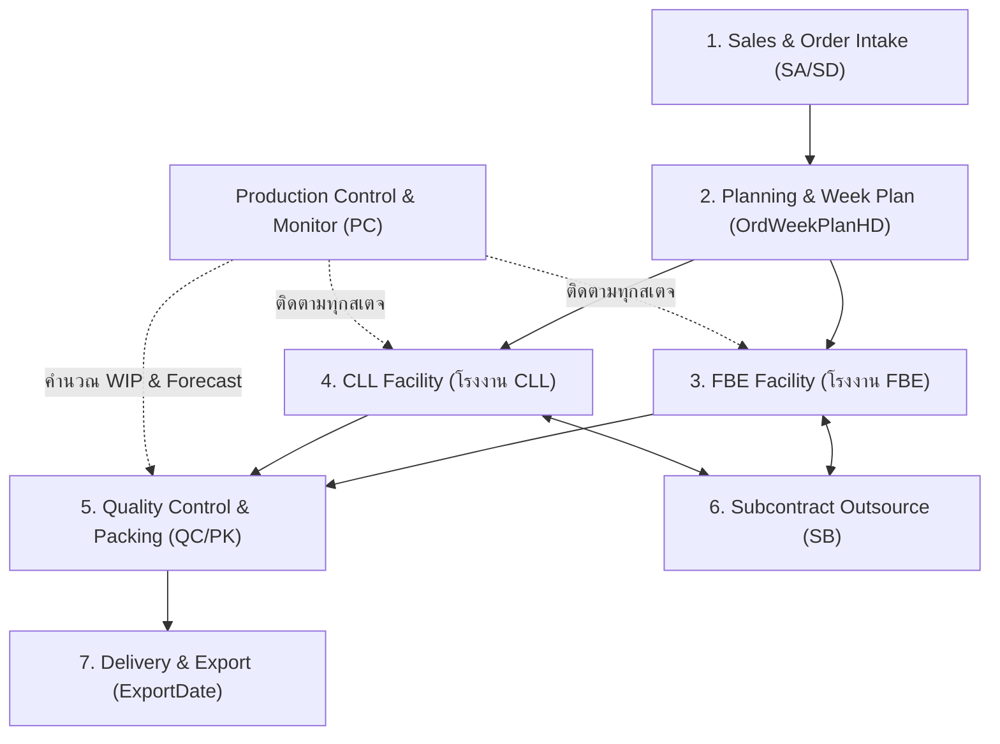
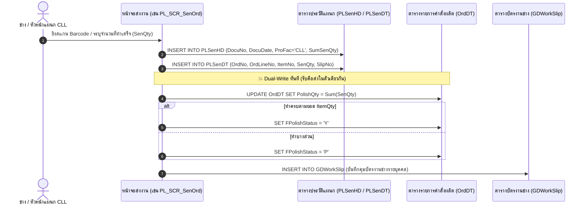

# โครงสร้างและกระบวนการทำงานระบบเก่า (PCC Management System Architecture)

> **เอกสารอ้างอิงเชิงลึก**: สรุปและถอดรหัสกระบวนการทำงาน, แหล่งจัดเก็บข้อมูล, ทิศทางการไหลของข้อมูล (Data Flow), และตารางฐานข้อมูลของระบบเก่าจาก Source Code จริง
> **โฟลเดอร์ระบบต้นทาง**: `D:\IT_Yu\[1] All in general\PCC Management System\PCC Management System`

---

## 1. ภาพรวมระบบและเทคโนโลยี (System Overview & Tech Stack)

* **ประเภทโปรแกรม**: Windows Forms Application (.NET Framework / Visual Basic .NET)
* **เครื่องมือทำรายงาน**: Crystal Reports 13 (`CrystalDecisions.CrystalReports.Engine`)
* **ฐานข้อมูลหลัก (Database Server)**:
  * **Server**: `CLLDBS` (ตามที่ระบุใน `SetConnDB.txt` และ `DataCenter.vb`)
  * **Database**: `dbGeneration` (ฐานข้อมูลหลักของกระบวนการผลิตและ Order)
  * **ฐานข้อมูลสนับสนุนในเครือ**: `CostDB`, `dbEnterprise`, `dbInventory`, `dbChongStock`, `dbTempStock`
* **การเชื่อมต่อไฟล์ภายนอก**:
  * โฟลเดอร์รูปภาพสินค้า / ตัวเรือน: `\\CHONGDTS\Chong Photo\...`
  * โฟลเดอร์คิวงาน PO และไฟล์แนบ: `\\BKKSQL\BKKQueue\...`

---

## 2. โมดูลหลักในระบบเก่า (Core Modules)

ระบบ PCC แบ่งการทำงานออกเป็น **7 เสาหลัก**:



1. **Sales & Order Processing (SA / SD)**: การรับใบสั่งซื้อ (Customer PO) และสร้าง Order
2. **Planning & Scheduling (ORD / Plan)**: การจัดคิวเข้าสัปดาห์ผลิต (`OrdWeekPlanHD`)
3. **FBE Production (FBE_*)**: สายการผลิตโรงงาน FBE (บันทึกแยกใบรับ `Rec` และใบส่ง `Sen`)
4. **CLL Production (*_SCR / *_SCN)**: สายการผลิตโรงงาน CLL (**บันทึกแบบ "รับคือส่งในตัวเดียวกัน"**)
5. **Subcontract Management (SB)**: ส่งงานจ้างเหมาภายนอก / ช่างนอกโรงงาน
6. **QC & Packing (QC / QP / PK)**: ตรวจสอบคุณภาพ 3 ระดับ และแพ็กสินค้า
7. **Production Control & Order Tracking (PC)**: ศูนย์ควบคุมและติดตามสถานะงานทุกแผนก

---

## 3. เจาะลึกความต่าง: กระบวนการ FBE vs CLL

ความแตกต่างระดับรากฐานระหว่าง **FBE** และ **CLL** ที่ค้นพบใน Source Code:

| มิติการทำงาน | โรงงาน FBE (`ProFac = 'FBE'`) | โรงงาน CLL (`ProFac = 'CLL'`) |
| :--- | :--- | :--- |
| **หน้าจอในระบบ** | มีคำนำหน้า `FBE_` เช่น `FBE_PL_SCR_SenOrd.vb`, `FBE_FL_SCR_SenOrd.vb` | หน้าจอมาตรฐาน เช่น `PL_SCR_SenOrd.vb`, `FL_SCN_SenOrd.vb`, `PT_SCN_SenOrd.vb` |
| **โครงสร้างตาราง** | **แยก 2 ด้านชัดเจน**: ตารางส่ง `{Step}SenHD/DT` และตารางรับ `{Step}RecHD/DT` | **มีเฉพาะตารางส่ง `{Step}SenHD/DT`** เท่านั้น (ไม่มีการเขียน `*Rec` เลย) |
| **พฤติกรรมการบันทึก** | **Formal Handover**: แผนก A ส่ง `Sen` ➔ รอแผนก B ยิงรับ `Rec` | **Station Milestone**: **"รับคือส่งในตัวเดียวกัน"** ยิงครั้งเดียวถือว่าผ่านสเตจนั้น |
| **การอัปเดตตัว Order** | เก็บเป็นประวัติการโอนย้ายในตาราง Rec/Sen | **Dual-Write**: บันทึกลงตาราง Sen พร้อมกับ **`UPDATE OrdDT` ตรงๆ ทันที** |
| **วิธีคำนวณงานค้าง (WIP)** | $\text{WIP} = \text{RecQty} - \text{SenQty}$ (ของที่รับเข้าแผนกแต่ยังไม่ส่งออก) | $\text{WIP} = \text{Stage}_{N} - \text{Stage}_{N+1}$ (ผลต่างยอดสะสมข้ามสเตจ) |

---

## 4. แผนผังการไหลของข้อมูลฝั่ง CLL (CLL Data Flow)

เมื่อสถานีช่างของ CLL ทำการบันทึกงาน (ตัวอย่าง: แผนกขัด `PL_SCR_SenOrd.vb`):



---

## 5. ตารางฐานข้อมูลและคอลัมน์สำคัญที่บันทึกข้อมูล (Database Catalog)

### 5.1 ตาราง Order หลัก (Master Orders)
* **`OrdHD` (Order Header)**
  * `OrdNo`: เลขที่คำสั่งผลิต (Primary Key)
  * `CustCode`: รหัสลูกค้า (เช่น N008, N098, N051, U414...)
  * `OrdDate`: วันที่สั่งงาน
  * `DueDate`: วันกำหนดส่งของโรงงาน
  * `CustDueDate`: วันกำหนดส่งที่ลูกค้าต้องการ
  * `ProFac`: โรงงานหลัก (`FBE` หรือ `CLL`)
  * `CloseStatus`: สถานะปิด Order (`Y` = จบงานสมบูรณ์)

* **`OrdDT` (Order Detail & Stage Tracking)**
  * `OrdNo`, `OrdLineNo`: คีย์หลักประจำรายการ
  * `ItemNo`: รหัสสินค้าเครื่องประดับ (เช่น BBS..., BES..., BNS...)
  * `ItemQty`: จำนวนสั่งผลิตทั้งหมด
  * **คอลัมน์ Milestone แสดงยอดผ่านแต่ละแผนกของฝั่ง CLL**:
    * `CastQty` / `FCastStatus`: จำนวนชิ้นที่ผ่านแผนกหล่อ (Casting)
    * `GrindQty` / `FGrindStatus`: จำนวนชิ้นที่ผ่านแผนกแต่ง (Grind / Filing)
    * `PolishQty` / `FPolishStatus`: จำนวนชิ้นที่ผ่านแผนกขัด (Polish)
    * `PlateQty` / `FPlateStatus`: จำนวนชิ้นที่ผ่านแผนกชุบ (Plating)
    * `QCQty` / `FQCStatus`: จำนวนชิ้นที่ผ่านการตรวจรับ (QC)
    * `FinishQty`: จำนวนชิ้นที่เสร็จสมบูรณ์ 100%
    * `StoneQty` / `FitQty`: จำนวนงานฝังพลอย / ชิ้นส่วนอะไหล่

---

### 5.2 ตาราง Transaction ประจำแผนก (Department Movement Tables)
มี 11 แผนกช่างหลัก โดยแยก Header (`HD`) และ Detail (`DT`):

| แผนกช่าง | รหัส | ตารางฝั่งส่ง (Send) | ตารางฝั่งรับ (Receive - FBE เท่านั้น) |
| :--- | :---: | :--- | :--- |
| **1. ฝัง / แต่ง** | `GR` | `GRSenHD`, `GRSenDT` | `GRRecHD`, `GRRecDT` |
| **2. ร่อน** | `TB` | `TBSenHD`, `TBSenDT` | `TBRecHD`, `TBRecDT` |
| **3. ประกอบ** | `AS` | `ASSenHD`, `ASSenDT` | `ASRecHD`, `ASRecDT` |
| **4. เลเซอร์** | `LS` | `LSSenHD`, `LSSenDT` | `LSRecHD`, `LSRecDT` |
| **5. ตะไบ / แต่งผิว** | `FL` | `FLSenHD`, `FLSenDT` | `FLRecHD`, `FLRecDT` |
| **6. ลิปปิ้ง / ปาดหน้า** | `LP` | `LPSenHD`, `LPSenDT` | `LPRecHD`, `LPRecDT` |
| **7. หยอดอีพ็อกซี่** | `EP` | `EPSenHD`, `EPSenDT` | `EPRecHD`, `EPRecDT` |
| **8. ขัดเงา** | `PL` | `PLSenHD`, `PLSenDT` | `PLRecHD`, `PLRecDT` |
| **9. ชุบทองแดง** | `CP` | `CPSenHD`, `CPSenDT` | `CPRecHD`, `CPRecDT` |
| **10. ตรวจรับ / QC** | `IQ` | `IQSenHD`, `IQSenDT` | `IQRecHD`, `IQRecDT` |
| **11. ชุบสำเร็จ** | `PT` | `PTSenHD`, `PTSenDT` | `PTRecHD`, `PTRecDT` |

**ฟิลด์สำคัญในตาราง SenHD**:
* `DocuNo`: เลขที่เอกสาร
* `DocuDate`: วันที่ส่งงาน
* `SenDept`: แผนกที่ส่ง (เช่น PL1, PL2, TA, TB...)
* `ProFac`: **`'CLL'` หรือ `'FBE'`** (ตัวแยกมิติโรงงาน)
* `SumSenQty`: ยอดรวมจำนวนชิ้น

---

### 5.3 ตารางคุมการผลิตและงานค้าง (Production Tracking Tables)
* **`OrdTrackDT`**: ตารางบันทึกการติดตาม Order แบบละเอียด
  * `QC1_Qty`, `QC1_Date`, `QC1_Fail`: ประวัติการตรวจ QC รอบที่ 1
  * `QC2_Qty`, `QC2_Date`, `QC2_Fail`: ประวัติการตรวจ QC รอบที่ 2
  * `QC3_Qty`, `QC3_Date`, `QC3_Fail`: ประวัติการตรวจ QC รอบที่ 3
  * `PackScanDo`, `PackScanSen`: การสแกนบรรจุภัณฑ์
* **`GDWorkSlip`**: บัตรคุมงานช่างรายบุคคล
  * `SlipID`, `SlipNo`, `DocuNo`, `OrdNo`, `ItemNo`, `Qty`
* **`GMHoliday`**: ปฏิทินวันหยุดโรงงาน
  * `HolDate`: วันหยุดประจำปี (ใช้คำนวณ Work Days จริง โดยตัดวันอาทิตย์และวันหยุด)
* **`OrdWeekPlanHD`**: แผนประจำสัปดาห์
  * `PlanYear`, `PlanWeek`, `PlanDate`: ใช้จับคู่สัปดาห์ W1-W52

---

## 6. ตรรกะการคำนวณงานค้าง (WIP Calculation Logic)

ใน Stored Procedure ของระบบเก่า ([PC_Show_OrdTrack_Sum_All.sql](file:///d:/gemstone-lifecycle-management/Jewelry%20Factory%20System/backend/sql/_baseline/PC_Show_OrdTrack_Sum_All.sql)) เมื่อไม่มีตาราง Rec ระบบใช้ **Stage Difference (ผลต่างระหว่างสเตจ)** ดังนี้:

```sql
-- 1. งานค้างรอแต่ง (Grind Pending)
GrindPenQty = CASE WHEN CastQty = ItemQty 
                   THEN ISNULL(GrindQty,0) - ISNULL(CastQty,0) 
                   ELSE ISNULL(GrindQty,0) - ISNULL(ItemQty,0) END

-- 2. งานค้างรอขัด (Polish Pending)
PolishPenQty = CASE WHEN GrindQty = ItemQty 
                    THEN ISNULL(PolishQty,0) - ISNULL(GrindQty,0) 
                    ELSE ISNULL(PolishQty,0) - ISNULL(ItemQty,0) END

-- 3. งานค้างรอชุบ (Plate Pending)
PlatePenQty = CASE WHEN PolishQty = ItemQty 
                   THEN ISNULL(PlateQty,0) - ISNULL(PolishQty,0) 
                   ELSE ISNULL(PlateQty,0) - ISNULL(ItemQty,0) END

-- 4. งานค้างรอ QC (QC Pending)
QCPenQty = CASE WHEN PlateQty = ItemQty 
                THEN ISNULL(QCQty,0) - ISNULL(PlateQty,0) 
                ELSE ISNULL(QCQty,0) - ISNULL(ItemQty,0) END

-- 5. งานที่ยังไม่เสร็จรวมทั้งใบ (Total Unfinished)
UnFinishQty = ISNULL(OrdDT.FinishQty,0) - ISNULL(OrdDT.ItemQty,0)
```

---

## 7. บทสรุปสำหรับการพัฒนาระบบใหม่ (Key Takeaways for New System)

1. **การรวมพลัง FBE + CLL**:
   * หน้า **Production Summary** สามารถนำเสนอผลงานได้ทั้ง 2 โรงงาน
   * **ฝั่ง FBE**: ดึงจาก `{Step}SenHD/DT WHERE ProFac = 'FBE'`
   * **ฝั่ง CLL**: ดึงจาก `{Step}SenHD/DT WHERE ProFac = 'CLL'`
   * ผลรวมทั้งสองคือ **Actual Factory Throughput รวมของทั้งเครือ**
2. **การดู WIP / Bottleneck**:
   * สามารถใช้สูตร Stage Delta ของระบบเก่ามาคำนวณหาจุดติดขัด (Bottleneck) ของโรงงาน CLL ได้โดยอัตโนมัติ โดยที่หน้างานไม่ต้องปรับวิธีการคีย์ข้อมูลแม้แต่น้อย
3. **การแสดงผลแบบไม่ต้องคลิก Filter**:
   * เราสามารถกางตารางแมทริกซ์ 11 แผนกช่าง พร้อมแยก FBE / CLL ในแถวเดียวกัน หรือสรุปภาพรวม 12 เดือนจบในหน้าจอเดียวตามขนาดจอ 1920×953 ได้อย่างสมบูรณ์แบบ
